<!--
  XySpace GitHub Profile — Haekal Saputra
  Tema visual: Purple + Ungu & Hitam, Metal 🟣⬛✨
  Palette: ink=#0d0c12  deep=#493465  accent=#6f4e91  shine=#a78bda  soft=#c4b5dc  white=#f5f3f8
  NO neon — deep, moody, premium, cinematic
-->

<div align="center">
  <picture>
    <source srcset="./assets/xyspace-header-animated.webp" type="image/webp">
    
  </picture>

  <!-- Floating particles overlay -->
  

  <br />

  

  <p>
    <a href="https://portofolio.haekal.web.id"></a>
    <a href="https://bio.xykel.my.id"></a>
    <a href="mailto:haekalsaputra01h@gmail.com"></a>
    <a href="https://wa.me/6283116632566"></a>
    <a href="https://www.tiktok.com/@xyy.k4l"></a>
  </p>

  

  <br /><br />

  
  

  <p>
    <sub>🎬 <strong>ABSOLUTE CINEMA</strong> — <em>Every frame is intentional. Every interaction is a scene.</em> &nbsp;•&nbsp; XySpace Cinematic Universe • EST 2024</sub>
  </p>
</div>


## `◈` About Haekal

```text
┌─────────────────────────────────────────────────────────┐
│  Name      : Haekal Saputra                             │
│  Alias     : xykalnotkel                                │
│  Company   : XySpace                                    │
│  Role      : Creative Technologist · App Developer      │
│  Focus     : Application Development · Creative Web     │
│             · Game Experiments                           │
│  Exploring : AI-assisted tools · Cloud workflows        │
│             · Digital product design                     │
│  Stack     : Flutter · Dart · Rust · TypeScript         │
│             · Python · Cloudflare · Figma · Unity       │
│  Base      : Indonesia 🇮🇩                              │
│  Email     : haekalsaputra01h@gmail.com                 │
│  Mission   : Turn useful ideas into clear, playful,     │
│              and accessible products.                    │
└─────────────────────────────────────────────────────────┘
```

I'm **Haekal Saputra** — a creative technologist and app developer from Indonesia who builds at the intersection of **function, visual identity, and playful interaction**. I don't treat development and design as separate worlds; I direct them like scenes in a film.

I build **XySpace** as a *cinematic technology universe* — where applications, web experiences, game-inspired interfaces, AI workflows & cloud ideas live as interconnected scenes. Every product I ship has a reason to exist, a visual language of its own, and a tactile feel that makes you want to interact with it again.

**What I actually do:**
- 📱 **Application Development** — Flutter & Dart for cross-platform apps (Android, iOS, Windows, Web). Clean architecture, Riverpod state, zero-divider design systems.
- 🌐 **Creative Web** — Responsive sites, portfolio experiences, visual identity systems, motion interfaces. Modern CSS, TypeScript, Cloudflare Workers.
- 🎮 **Game Experiments** — Unity & Godot prototyping. Game-inspired UI that stays usable. Shader play, not shader soup.
- 🤖 **AI as Co-Director** — AI accelerates my exploration. I decide what ships. Human judgment, non-negotiable.
- ☁️ **Cloud & Infra** — Cloudflare Workers + Durable Objects, TURN/STUN, CI/CD GitHub Actions. Zero-cost stacks, zero VMs.
- 🎨 **Design Systems** — Figma-driven tokens, restrained palettes (purple-black-metal), CustomPainter glyphs, cinematic motion.

**Philosophy in one line:**
> **🎬 Build with purpose. Experiment with curiosity. Ship with care.** — *An absolute cinema of useful ideas.*

<div align="center">
  
  `DIRECTED BY HAEKAL` • `PRODUCED BY XYSPACE` • `CINEMATOGRAPHY: CODE & PIXELS` • `SOUNDTRACK: KEYSTROKES`

</div>


## `◇` Development Orbit — *Three Acts*

<table>
  <tr>
    <td width="33%" valign="top" style="background:#0d0c12; border:1px solid #3d2a5c; padding:14px; border-radius:12px;">
      <h3>◉ ACT I — Applications</h3>
      <p>Turning ideas into practical application concepts, prototypes, and user-friendly digital experiences. <em>The protagonist.</em></p>
      <p><code>Flutter</code> <code>Dart</code> <code>Rust</code> <code>Android</code> <code>iOS</code></p>
    </td>
    <td width="33%" valign="top" style="background:#0d0c12; border:1px solid #3d2a5c; padding:14px; border-radius:12px;">
      <h3>◌ ACT II — Creative Web</h3>
      <p>Responsive websites, portfolio experiences, visual systems, motion & modern interfaces. <em>The world-building.</em></p>
      <p><code>TypeScript</code> <code>Cloudflare</code> <code>CSS</code> <code>Figma</code></p>
    </td>
    <td width="33%" valign="top" style="background:#0d0c12; border:1px solid #3d2a5c; padding:14px; border-radius:12px;">
      <h3>✦ ACT III — Playful Tech</h3>
      <p>Game experiments, interactive visuals, AI tools, cloud exploration & unusual product ideas. <em>The plot twist.</em></p>
      <p><code>Unity</code> <code>Python</code> <code>WebRTC</code> <code>AI</code></p>
    </td>
  </tr>
</table>

<div align="center">

### Areas I Work With & Explore


<br />


</div>


## `◆` Featured Builds — *Now in Production*

<div align="center">

[](https://github.com/xykalnotkel/XyDesk)

</div>

| | Project | Description | Stack |
|---|---|---|---|
| 🎬 | [**XyDesk**](https://github.com/xykalnotkel/XyDesk) | Low-latency remote desktop for gaming & work — Quiet Surface design, zero-divider UI, WebRTC streaming, Cloudflare signaling (free tier) | `Flutter` `Rust` `WebRTC` `Cloudflare Workers` |


## `✦` Current Mission — *Now Showing*

> "Purple is not a color. It's a feeling. It's a universe."

- 🎬 **Directing the XySpace cinematic universe** — identity + digital ecosystem, frame by frame.
- 🧪 **Learning by shipping** — practical app & web experiments, not endless trailers.
- 🎮 **Game-inspired interaction** that stays usable — cinema without motion sickness.
- 🤖 **AI as co-director** — it accelerates, I decide.
- ☁️ **Zero-cost infrastructure** — Cloudflare free tier, GitHub Actions CI/CD, no VMs, no credit card.
- 📼 **Building a portfolio that feels useful, distinctive, and honest** — no filler scenes.


## `◎` GitHub Insights

<div align="center">
  
  
</div>

<br />

<div align="center">
  
</div>

<br />

<div align="center">
  
</div>

<br />

<div align="center">
  
</div>

## `⌁` Contribution Journey

<div align="center">
  <picture>
    <source media="(prefers-color-scheme: dark)" srcset="https://raw.githubusercontent.com/xykalnotkel/xykalnotkel/output/github-snake-dark.svg" />
    <source media="(prefers-color-scheme: light)" srcset="https://raw.githubusercontent.com/xykalnotkel/xykalnotkel/output/github-snake.svg" />
    
  </picture>
</div>


## `◈` XySpace Principles

<table>
  <tr>
    <td align="center" style="background:#0d0c12; border:1px solid #3d2a5c; padding:14px; border-radius:8px; color:#f5f3f8;">
      <strong style="color:#a78bda; font-size:15px;">⚡ Useful first</strong><br/><br/>
      A visual idea should still solve a real problem. Pretty without purpose is decoration, not design.
    </td>
    <td align="center" style="background:#0d0c12; border:1px solid #3d2a5c; padding:14px; border-radius:8px; color:#f5f3f8;">
      <strong style="color:#a78bda; font-size:15px;">🎮 Playful, not confusing</strong><br/><br/>
      Interaction can feel fun while remaining understandable. Cinema without motion sickness.
    </td>
  </tr>
  <tr>
    <td align="center" style="background:#0d0c12; border:1px solid #3d2a5c; padding:14px; border-radius:8px; color:#f5f3f8;">
      <strong style="color:#a78bda; font-size:15px;">🧪 Learn by building</strong><br/><br/>
      Small working experiments teach more than endless planning. Ship to learn.
    </td>
    <td align="center" style="background:#0d0c12; border:1px solid #3d2a5c; padding:14px; border-radius:8px; color:#f5f3f8;">
      <strong style="color:#a78bda; font-size:15px;">🤖 Human-directed AI</strong><br/><br/>
      AI accelerates exploration; judgment and responsibility stay human. I decide.
    </td>
  </tr>
  <tr>
    <td align="center" colspan="2" style="background:#0d0c12; border:1px solid #3d2a5c; padding:14px; border-radius:8px; color:#f5f3f8;">
      <strong style="color:#a78bda; font-size:15px;">✨ Keep evolving</strong><br/><br/>
      XySpace is a space for continuous iteration and discovery. Nothing is final until it's useful.
    </td>
  </tr>
</table>


<div align="center">
  <a href="https://portofolio.haekal.web.id"><strong>Portfolio</strong></a>
  &nbsp;•&nbsp;
  <a href="https://bio.xykel.my.id"><strong>Bio</strong></a>
  &nbsp;•&nbsp;
  <a href="mailto:haekalsaputra01h@gmail.com"><strong>Email</strong></a>
  &nbsp;•&nbsp;
  <a href="https://wa.me/6283116632566"><strong>WhatsApp</strong></a>
  &nbsp;•&nbsp;
  <a href="https://www.tiktok.com/@xyy.k4l"><strong>TikTok</strong></a>

  <br /><br />

  <sub>Designed for <strong>Haekal Saputra</strong> · Building <strong>XySpace</strong> from Indonesia 🇮🇩</sub>
</div>
