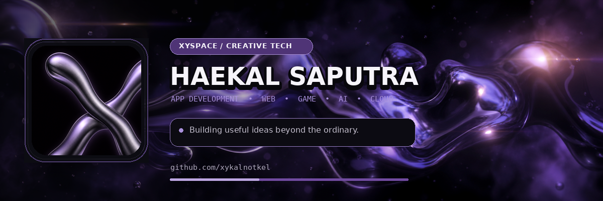

# XySpace GitHub Profile — Setup Guide

Paket ini dibuat untuk akun GitHub **xykalnotkel**.
Tema visual: **Purple + Ungu & Hitam, Metal** 🟣⬛✨

---

## 1. Buat repository profil

1. Masuk ke GitHub.
2. Buat repository public baru.
3. Nama repository harus persis: `xykalnotkel`.
4. Jangan ubah struktur folder paket ini.
5. Unggah seluruh isi folder ke root repository tersebut.

Struktur akhirnya:

```text
xykalnotkel/
├── .github/
│   └── workflows/
│       └── snake.yml
├── assets/
│   ├── xyspace-avatar.png
│   ├── xyspace-avatar.webp
│   ├── xyspace-header-animated.webp
│   ├── xyspace-header.gif
│   ├── xyspace-header.png
│   ├── xyspace-header.webp
│   ├── xyspace-orbit-divider.svg
│   ├── xyspace-social-preview.png
│   ├── xyspace-social-preview.webp
│   ├── xyspace-typing.svg
│   ├── xyspace-particles.svg
│   ├── xyspace_cosmic_scene_ai.png
│   ├── xyspace_cosmic_scene_ai.webp
│   ├── xyspace_emblem_ai.png
│   └── xyspace_emblem_ai.webp
├── build_assets.py
├── requirements.txt
├── SETUP.md
├── LICENSE
└── README.md
```

File `build_assets.py` hanya diperlukan untuk **membangun ulang** banner dan
avatar dari source image (`xyspace_cosmic_scene_ai.png` +
`xyspace_emblem_ai.png`). Untuk kebanyakan orang, README saja sudah cukup —
file ini opsional dan tidak perlu dihapus.

---

## 2. Aktifkan contribution snake

1. Buka repository `xykalnotkel/xykalnotkel`.
2. Masuk ke **Settings → Actions → General**.
3. Pada **Workflow permissions**, pilih **Read and write permissions**.
4. Simpan pengaturan.
5. Buka tab **Actions**.
6. Pilih workflow **Generate contribution snake**.
7. Tekan **Run workflow**.
8. Setelah berhasil, workflow membuat branch `output` dan animasi akan muncul di README.

Workflow juga berjalan otomatis setiap hari (00:17 UTC).
Concurrency control sudah aktif — jika ada workflow yang sedang berjalan, yang baru akan menunggu atau membatalkan yang lama.

---

## 3. Gunakan avatar XySpace

Gunakan file berikut sebagai foto profil GitHub:

```text
assets/xyspace-avatar.png
```

File sudah berukuran 1024 × 1024 px dan memiliki ruang aman untuk crop lingkaran.

---

## 4. Atur social preview repository

Untuk preview saat repository dibagikan:

1. Buka **Settings** repository.
2. Cari **Social preview**.
3. Unggah `assets/xyspace-social-preview.png`.

---

## 5. Atur repo metadata

Di halaman utama repository, klik ⚙️ di sebelah "About":

- **Description**: `Haekal Saputra · XySpace — Purple Metal Universe · App Dev · Creative Web · Playful Tech`
- **Website**: `https://portofolio.haekal.web.id`
- **Topics**: `profile`, `github-profile`, `xyspace`, `creative-technologist`, `flutter`, `rust`, `purple-theme`

---

## 6. Tautan yang sudah dipasang

| Platform | URL |
|---|---|
| GitHub | `https://github.com/xykalnotkel` |
| Portfolio | `https://portofolio.haekal.web.id` |
| Bio | `https://bio.xykel.my.id` |
| TikTok | `https://www.tiktok.com/@xyy.k4l` |
| WhatsApp | `https://wa.me/6283116632566` |
| Email | `haekalsaputra01h@gmail.com` |

> **Catatan privasi:** tombol WhatsApp mengarah ke nomor publik. Hapus badge dan tautannya dari `README.md` jika nomor tidak ingin tersedia secara terbuka.

---

## 7. Membangun ulang aset (opsional)

Jika ingin mengubah banner atau avatar:

1. Pastikan Python ≥3.10 dan Pillow terinstal:
   ```bash
   pip install -r requirements.txt
   ```
2. Ganti source image di `assets/`:
   - `xyspace_cosmic_scene_ai.png` — background nebula/galaxy
   - `xyspace_emblem_ai.png` — logo emblem
3. Jalankan:
   ```bash
   python build_assets.py
   ```
4. File output akan di-regenerate di `assets/`.

**Font:** Script menggunakan DejaVu Sans. Jika tidak ditemukan, script akan
mencoba fallback ke font system lain (Linux → macOS → Windows). Jika semua
gagal, edit variabel `FONT_*` di `build_assets.py` untuk mengarahkan ke font
yang tersedia.

---

## 8. Custom typing SVG

Animasi typing (`xyspace-typing.svg`) dibuat menggunakan
[readme-typing-svg](https://github.com/DenverCoder1/readme-typing-svg).

URL saat ini:
```text
https://readme-typing-svg.demolab.com?font=Inter&weight=600&size=24&duration=3500&pause=1500&color=F5F3F8&center=true&vCenter=true&multiline=true&width=760&height=100&lines=Creative+Technologist+·+App+Developer;Building+XySpace+—+frame+by+frame;Purple+metal+universe+·+EST+2024
```

Untuk mengubah teks, edit parameter `lines=` di URL tersebut.

---

## 9. Jika banner animasi terasa berat

README sudah menggunakan `<picture>` dengan prioritas WebP (392KB) lalu fallback GIF.
Untuk versi paling ringan, ganti ke static PNG:

```html

```

---

## 10. Mengubah isi profil

Semua teks utama berada di `README.md`. Bagian yang aman diubah:

- About Haekal
- Development Orbit
- Current Mission
- Areas I Work With & Explore
- XySpace Principles
- Featured Builds

Statistik sudah diarahkan ke username `xykalnotkel`.

---

## Palette referensi (Purple + Ungu & Hitam, Metal)

| Token | Hex | Penggunaan |
|---|---|---|
| `ink` | `#0d0c12` | Background utama |
| `deep` | `#493465` | Purple dalam, badge secondary |
| `accent` | `#6f4e91` | Purple medium, borders |
| `shine` | `#a78bda` | Purple aksen, judul, ring |
| `soft` | `#c4b5dc` | Purple lembut, ikon, subteks |
| `white` | `#f5f3f8` | Teks utama |
